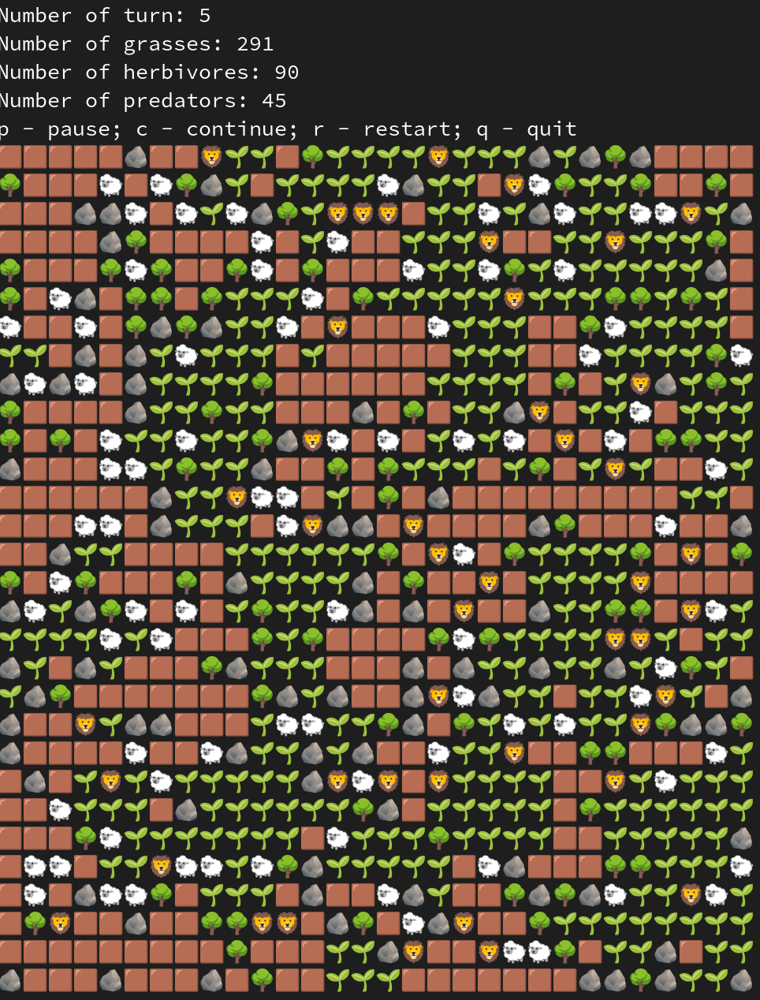

# Симуляция

## Цель проекта
- Отработать ООП
- Отработать следующие паттерны проектирования: Команда, Абстрактная фабрика
- Отработать принципы SOLID

## О проекте 
Проект из RoadMap'а Сергея Жукова

Проект представляет собой симуляцию жизни, в которой есть следующие сущности:

- Камни и деревья — препятствия для передвигающихся объектов;
- Трава — пища для травоядных. Имеет возможность к фотосинтезу, что позволяет расти на соседних клетках. Может увядать со случайным темпом
- Травоядные — передвигающееся существо, имеющее здоровье. Цель данного существа — найти траву, чтобы съесть её и повысить своё здоровье;
- Хищники — передвигающееся существо, которое также имеет здоровье. Цель хищника — найти травоядного и «откусить» от него кусок;

## Правила
Создаётся карта, на которой располагаются все сущности. Симуляция обновляется каждые 2 секунды. На экран выводится следующая информация:

- Номер итерации симуляции;
- Количество травы;
- Количество травоядных;
- Количество хищников;
- Правила для управления симуляцией.

После выводится сам результат симуляции с помощью эмодзи. Для корректного вывода симуляции желательно использовать моноширинный шрифт с резервным шрифтом «Noto Color Emoji».
